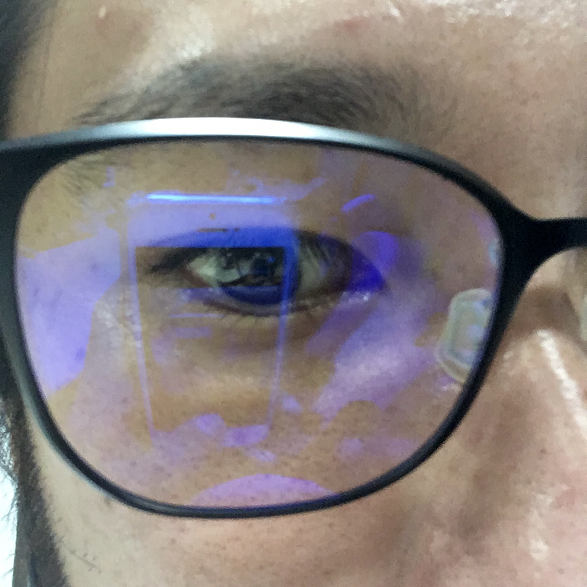
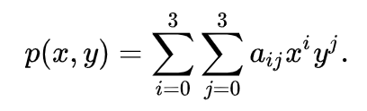
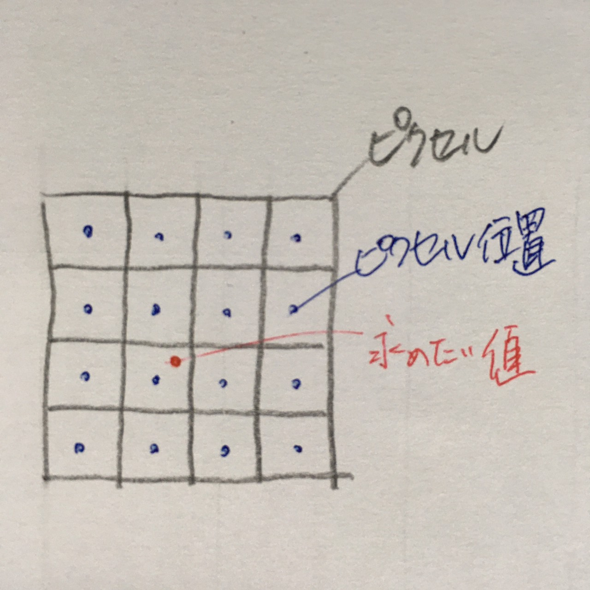
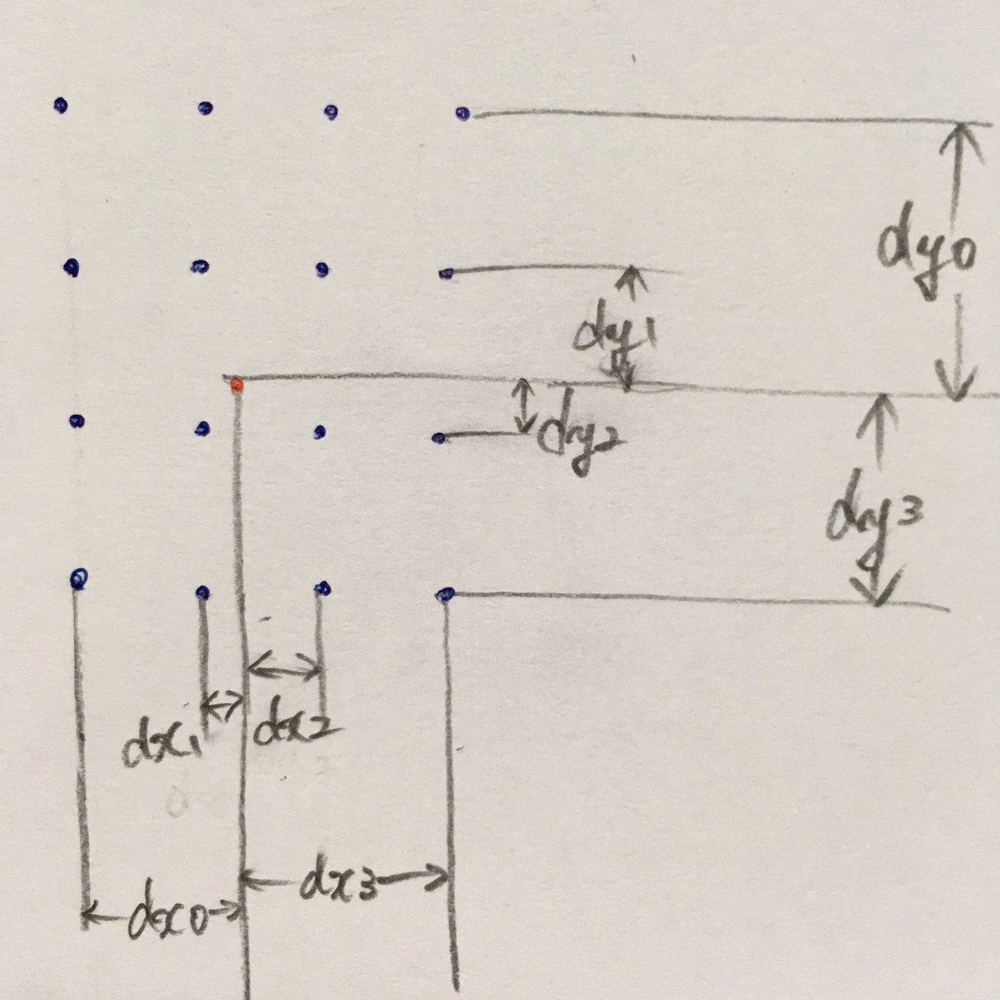
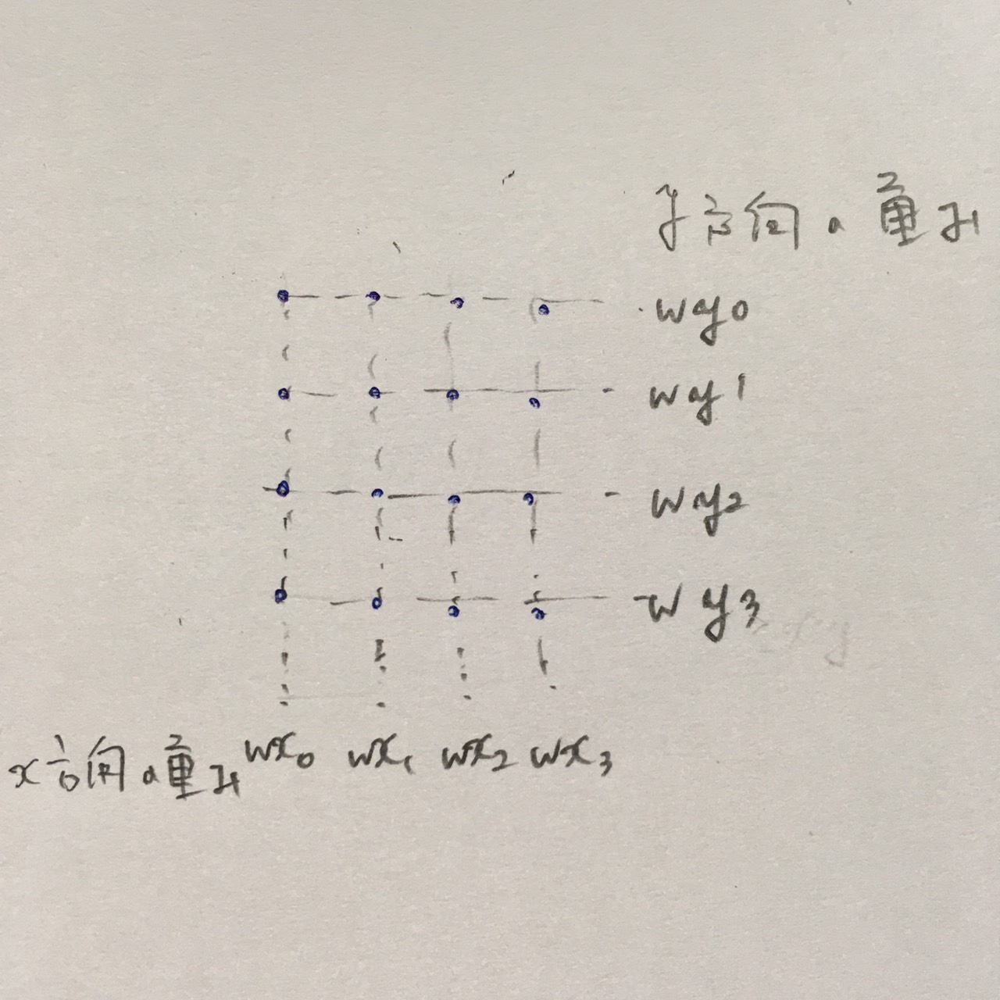
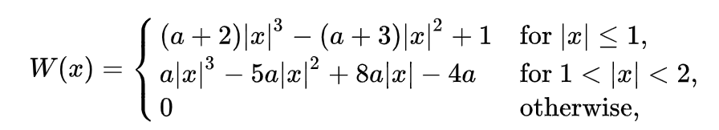
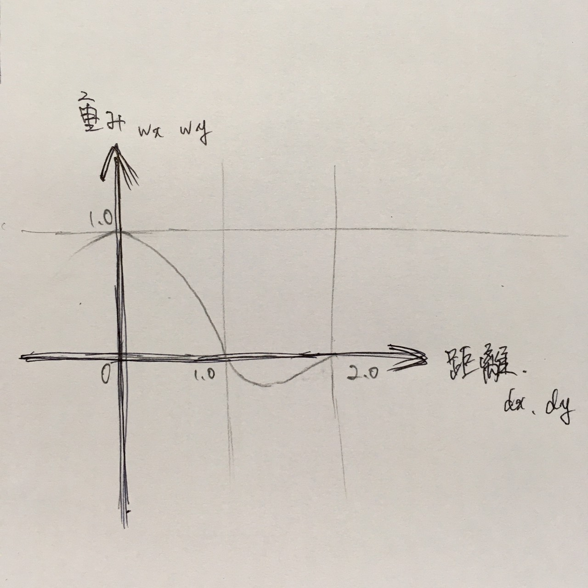
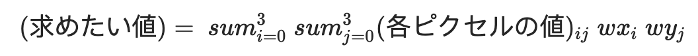

<h1 style="text-align: center;">
DIP homework 1
</h1>
<div style="text-align: right;">
R08922160<BR>
Natsuki Yamashita(山下夏輝)
</div>

## 1. Write a program for non-integer scaling of an image with two interpolation methods: Bilinear interpolation, Bicubic interpolation.
### Which function I use or implement

+ cv2.imread: for reading an image file
+ cv2.resize: for interpolating an image
+ cv2.imwrite: for outputting an image as a file

### How does my program work

1. Read a source image
2. Call `myresize_1` function which I created and the source image, a method and an output file name are passed to the function.
3. Call `cv2.resize` function for interpolation and the source image, the size of resized image, scales of resizing and the method of interpolation is passed to the function. The resized image is returned.
    + Set _None_ to the size because the value is used
    + Set non-integer to the scale value of x and the scale of y each
    + Set `cv2.INTER_LINEAR` or `cv2.INTER_CUBIC` to the value of interpolation      
4. Call `cv2.imwrite` function and output the resized image.


The corresponding part of my code is as following.

```
########## def function ##########
def myresize_1(img, method, save_fname):
   if method == 'linear':
       img = cv2.resize(img, dsize=None, fx=0.1, fy=0.1, interpolation = cv2.INTER_LINEAR)
   elif method == 'cubic':
       img = cv2.resize(img, dsize=None, fx=0.1, fy=0.1, interpolation = cv2.INTER_CUBIC)
   cv2.imwrite(save_fname, img)


########## set params ##########
src_img = cv2.imread(r'../img/original.jpg')
method_list = ['linear','cubic']

########## processing ##########
for method in method_list:
   fname = '../img/{}.jpg'.format(method)
   myresize_1(src_img, method, fname)
```

<!-- </span> -->
### How to use my program

The environment I execute this program is as following

+ Python==3.7.2
+ opencv_python_headless==4.4.0.44
+ matplotlib==3.1.3
+ numpy==1.18.1

Typing the following command when you run this program.

```
python3 hw1.py 1
```

## 2. Take a selfie of yourself, and apply the above image scaling program on your selfie (or part of your selfie, e.g., your right eye) with the scaling factors of 0.1, 5.0 and 30.
### Which function I use or implement

+ cv2.imread: for reading an image file
+ cv2.resize: for interpolating an image
+ cv2.imwrite: for outputting an image as a file

### How does my program work
1. Read a source image.
2. Call `myresize_2` function which I created and the source image, a method and an output file name are passed to the function.
3. Call `cv2.resize` function for interpolation and the source image, the size of resized image, scales of resizing and the method of interpolation is passed to the function. The resized image is returned.
    + Set _None_ to the size because the value is used
    + Set a certain scaling value to the scale value of x and the scale of y each
    + Set `cv2.INTER_LINEAR` or `cv2.INTER_CUBIC` to the value of interpolation      
4. Call `cv2.imwrite` function and output the resized image.


The corresponding part of my code is as following.

```
########## def function ##########
def myresize_2(img, method, scale, save_fname):
    if method == 'linear':
        img = cv2.resize(img, dsize=None, fx=scale, fy=scale, interpolation = cv2.INTER_LINEAR)
    elif method == 'cubic':
        img = cv2.resize(img, dsize=None, fx=scale, fy=scale, interpolation = cv2.INTER_CUBIC)
    cv2.imwrite(save_fname, img)
    print('SAVED {} !'.format(save_fname))

########## set params ##########
src_img = cv2.imread(r'../img/original.jpg')
method_list = ['linear','cubic']
########## set params for task 2 ##########
scale_list = [0.1, 5.0, 30]
########## processing ##########
for method in method_list:
    for scale in scale_list:
        fname = '../img/{}_{}.jpg'.format(method,scale)
        myresize_2(src_img, method, scale, fname)
```

### How to use my program

The environment I execute this program is as following
+ Python==3.7.2
+ opencv_python_headless==4.4.0.44
+ matplotlib==3.1.3
+ numpy==1.18.1

Typing the following command when you run this program.

```
python3 hw1.py 2
```

## 3. Compare the quality of the images obtained with bilinear interpolation and with bicubic interpolation.
### 3-1. Simple comparison
#### Resulted images for comparison

__Original__


| method   | 0.1                                                        | 5.0                                                         | 30                                                         |
|:---------|:-----------------------------------------------------------|:------------------------------------------------------------|:-----------------------------------------------------------|
| Bilinear |  |  |  |
| Bicubic  |  |   |   |

#### Explanation

The original image, bilinear and bicubic interpolated images by each scale are as above. I've simply resized each interpolated image to the same size as the original for the convenience of posting the images in this report.

When the original image is reduced to 0.1 scale, those differences are obvious in both interpolation method. On the other hand, when the original image is scaled up to 5 or 30, the differences are unclear in both interpolation method.

When comparing images interpolated at the same scale and using the two methods, the difference in their quality is not visible by the naked eye.

#### About program

The program which generates these images works as follows.
1. Read a source image and get the height and the width.
2. Read each image which generated in task 2.
3. Call `myresize_3` function which I created and the image which generated in task 2., the height, the width and an output file name are passed to the function.
4. Call `cv2.resize` function for interpolation and the source image, the size of resized image, scales of resizing and the method of interpolation is passed to the function. The resized image is returned.
    + Set the width and the height of the original image to the size.    
5. Call `cv2.imwrite` function and output the resized image.


The corresponding part of my code is as following.

```
########## def function ##########
def myresize_3(img, height, width, save_fname):
    img = cv2.resize(img, dsize=(width, height))
    cv2.imwrite(save_fname, img)
    print('SAVED {} !'.format(save_fname))

########## set params ##########
src_img = cv2.imread(r'../img/original.jpg')
method_list = ['linear','cubic']
########## set params for task 3 ##########
height, width, channel = src_img.shape
########## processing ##########
for method in method_list:
    for scale in scale_list:
        fname = '../img/{}_{}.jpg'.format(method,scale)
        save_fname = '../img/resized_{}_{}.jpg'.format(method,scale)
        img = cv2.imread(fname)
        myresize_3(img, height, width, save_fname)
```

The environment I execute this program is as following
+ Python==3.7.2
+ opencv_python_headless==4.4.0.44
+ matplotlib==3.1.3
+ numpy==1.18.1

Typing the following command when you run this program.

```
python3 hw1.py 3
```

### 3-2. Differences between two interpolation methods
#### Resulted images for comparison

__Original__


| method             | 0.1                                               | 5.0                                               | 30                                               |
|:-------------------|:--------------------------------------------------|:--------------------------------------------------|:-------------------------------------------------|
| Bilinear - Bicubic |  |  |  |

#### Explanation

3-1.Simple comparison did not show any difference in quality, so we used the differences between the two methods of interpolation to check whether there is actually a difference between the two methods of interpolation. Subtracted differences between images of the same scale that were interpolated by each method are shown above. Also I've simply resized each interpolated image to the same size as the original for the convenience of posting the images in this report.

In view, the black areas indicate that there is no difference between the images interpolated in each method, and the other colored areas indicate that there is a difference.

At 0.1, there is an overall difference; at 5.0, there is a noticeable difference in the contour of the glasses and in the reflections on the glasses and in the shape of the eyes; at 30, the difference is almost exclusively in the shape of the glasses.

Thus, the differences in the interpolation images of each method at the same scale are not visible to the naked eye, but they are different in pixels.

#### About program

The program which generates these images works as follows.

1. Read a source image and get the height and the width.
2. Read each image which generated in task 2.
3. Subtracting the each value in pixels of the interpolated image by bicubic from of of the interpolated image by bilinear.
4. Call `cv2.resize` function for interpolation and the source image, the size of resized image, scales of resizing and the method of interpolation is passed to the function.
    + Set the width and the height of the original image to the size.    
5. Call `cv2.imwrite` function and output the resized image.

The corresponding part of my code is as following.

```
########## set params ##########
src_img = cv2.imread(r'../img/original.jpg')
method_list = ['linear','cubic']
########## set params for task 3 ##########
height, width, channel = src_img.shape
########## processing ##########
for scale in scale_list:
    linear_fname = '../img/{}_{}.jpg'.format(method_list[0],scale)
    cubic_fname = '../img/{}_{}.jpg'.format(method_list[1],scale)
    save_fname = '../img/diff_{}.jpg'.format(scale)
    img_linear = cv2.imread(linear_fname)  
    img_cubic = cv2.imread(cubic_fname)  
    diff = img_linear - img_cubic
    # resize img to the size of original because Atom markdown extention does not work for the largest images
    resized_diff = cv2.resize(diff, dsize=(width, height))
    cv2.imwrite(save_fname, resized_diff)
    print('SAVED {} !'.format(save_fname))
```

The environment I execute this program is as following

+ Python==3.7.2
+ opencv_python_headless==4.4.0.44
+ matplotlib==3.1.3
+ numpy==1.18.1

Typing the following command when you run this program.

```
python3 hw1.py diff
```

### 3-3. Edge comparison
#### Resulted images for comparison

__Original__

| method   | 0.1                                                      | 5.0                                                      | 30                                                      |
|:---------|:---------------------------------------------------------|:---------------------------------------------------------|:--------------------------------------------------------|
| Bilinear |  |  |  |
| Bicubic  |   |   |   |

#### Explanation
In 3-2.Differences between two interpolation methods, we found that there was a difference between the two images, so we interpreted the blurred edges of the photos as low quality and attempted to explain the difference in quality of each image by edge detection. The edge detected images from the images interpolated by each scale and each method are shown above. The function of edge detection which I used is `cv2.Canny` because from the information on the Internet, this function seems to be used frequently. The two thresholds which is needed in `cv2.Canny` function is adjusted manually to make the differences visible to the naked eye. Also, I've simply resized each interpolated image to the same size as the original for the convenience of posting the images in this report.

Overall, the edges of bilinear-interpolated images are less detectable than bicubic. At 0.1, the area of nasal reflection that is very clearly visible in the original image has detected edges in bicubic method but not in bilinear method; at both of 5.0 and 30, the edges are relatively clear in bicubic, yet they are almost not detected in bilinear.

From the above, it can be said that bicubic has a clearer edge, so the detected edges are more numerous and the quality is higher. On the other hand, bicubic has a clear edge and the quality is lower than bilinear.

#### About program
The program which generates these images works as follows.

1. Read a source image and get the height and the width.
2. Read each image which generated in task 2 with gray scale.
3. Set the values of the thresholds.
4. Call `cv2.Canny` function for edge detection and the gray scaled image and the values of thresholds is passed to the function.
5. Call `cv2.resize` function for interpolation and the source image, the size of resized image, scales of resizing and the method of interpolation is passed to the function.
    + Set the width and the height of the original image to the size.     
6. Call `cv2.imwrite` function and output the resized image.


The corresponding part of my code is as following.

```
########## set params ##########
src_img = cv2.imread(r'../img/original.jpg')
method_list = ['linear','cubic']
########## set params for task 3 ##########
height, width, channel = src_img.shape
########## processing ##########
for method in method_list:
    for scale in scale_list:
        fname = '../img/{}_{}.jpg'.format(method,scale)
        save_fname = '../img/edge_{}_{}.jpg'.format(method,scale)
        gray_img = cv2.imread(fname, cv2.IMREAD_GRAYSCALE)
        if scale == 0.1:
            thho1 = 480
            thho2 = 100
        elif scale == 5.0:
            thho1 = 40
            thho2 = 25
        elif scale == 30:
            thho1 = 7
            thho2 = 4
        else:
            print('ERROR! The value of scale may be wrong!')
        canny_img = cv2.Canny(gray_img, thho1, thho2)
        # resize img to the size of original because Atom markdown extention does not work for the largest images
        resized_canny = cv2.resize(canny_img, dsize=(width, height))
        cv2.imwrite(save_fname, resized_canny)
        print('SAVED {} !'.format(save_fname))
```

The environment I execute this program is as following

+ Python==3.7.2
+ opencv_python_headless==4.4.0.44
+ matplotlib==3.1.3
+ numpy==1.18.1

Typing the following command when you run this program.

```
python3 hw1.py edge
```

## 4. Explain the method of bicubic interpolation, and compare its computational complexity with that of bilinear interpolation.
### The method of bicubic interpolation

The method of bicubic interpolationとは画像の拡大縮小処理を行う際、ピクセルの値を該当するピクセルの位置の周囲にある16個のピクセルの値を利用し、算出する手法のことである。その公式を以下に示す。
<div style="text-align: center;">

</div><div style="text-align: right;">
（出典：https://en.wikipedia.org/wiki/Bicubic_interpolation 参照日時：2020/10/27 22:01）<BR><BR>
</div>

手書きの図を用いながら、この公式について、以下説明する。

  + 16個のピクセルの位置と値を参照する。
      参照するピクセルを黒の四角、参照するピクセルの位置を青、求めたい値の位置を赤で示す。
      <div style="text-align: center;">
      
      </div>
  + 求めたい値の位置と参照するピクセルの位置の距離を算出する。
      x方向の距離を dx<sub>0-3</sub> 、y方向の距離を dy<sub>0-3</sub> とする。
      <div style="text-align: center;">
      
      </div>
  + 求めた距離（dx<sub>0-3</sub>, dy<sub>0-3</sub>）を用いて、各ピクセルの値に対する重みを算出する。
      0 <= i <= 3, 0 <= j <= 3, 各ピクセルの値に対する重みをwx<sub>i</sub>, wy<sub>j</sub>とする。
      <div style="text-align: center;">
      
      </div>
      重みを求める公式は、以下に示す。下記公式において a は係数を表し、通常、-0.5または-0.75に設定される。下記 x は、ここでの dx<sub>0-3</sub>, dy<sub>0-3</sub> と同義である。
      <div style="text-align: center;">
      
      </div><div style="text-align: right;">
      （出典：https://en.wikipedia.org/wiki/Bicubic_interpolation 参照日時：2020/10/27 22:01）<BR><BR>
      </div>
      重みを求める公式をグラフで表すと下記のようになる。
      <div style="text-align: center;">
      
      </div>
  + 16個のピクセルの値と、それらのピクセルの値に対する16個の重みを用いて、値を算出する。
      <div style="text-align: center;">
      
      </div>
  + 座標 x,y の求めたい値を p(x,y)、各ピクセルの値を a、重み wx を x 、重み wy を y とすると上記公式が導き出される。
      <div style="text-align: center;">
      
      </div>

### Resulted images for comparison

<div style="text-align: center;">

</div>

### Explanation

各スケール値におけるinterpolationの処理の実行時間の平均値の推移を上記に示す。bilinearは青色、またbicubicは緑色の線で示した。ｙ軸は処理1回あたりに要した実行時間の平均値、ｘ軸はスケールの値である。上記表からわかるように、ほぼ全てのスケールにおいて、bicubicの実行時間の平均値は、bilinearのそれよりも高い。このことから、bicubicの計算複雑性の方が大きいといえる。また、bilinearは、周囲の4つのピクセルを利用して値を求めるのに対し、bicubicは、前に述べたように周囲の16個のピクセルを利用して値を求める為、計算量が多いのは明らかである。

### About program

The program which generates these images works as follows.

1. Read a source image.
2. List of values from 0 to 10 in increments of 0.2
3. Set the values of iteration for calculating average time to interpolate each time.
4. Call `mygettime` function and pass a source img, scale, number of iteration.
5. Call `time.time` to record the time when the process of interpolation starts and finish.
6. Subtract start-time from end-time to get actual time taken to process.
7. After the iteration process, divide the total time taken by the number of iteration and calculate the average time taken per a process of interpolation.
8. Plot the average processing time at each scale in a graph and output it.

The corresponding part of my code is as following.

```
########## def function ##########
def mygettime(img, method, scale, num_of_times):
    if scale == 0:
        avg_t = 0
    else:
        src_img = img
        total_t = 0
        for i in range(num_of_times):
            start_t = time.time()
            if method == 'linear':
                img = cv2.resize(src_img, dsize=None, fx=scale, fy=scale, interpolation = cv2.INTER_LINEAR)
            elif method == 'cubic':
                img = cv2.resize(src_img, dsize=None, fx=scale, fy=scale, interpolation = cv2.INTER_CUBIC)
            end_t = time.time()
            total_t += end_t - start_t
        avg_t = total_t / num_of_times
    print('Method: {}, Scale: {}'.format(method,scale))
    return avg_t

########## set params ##########
src_img = cv2.imread(r'../img/original.jpg')
method_list = ['linear','cubic']
########## set params for task 4 ##########
scale_list_for_gettime = [i/10 for i in range(0,101,2)]
num_of_times = 50
########## processing ##########
avg_t_list = []
for method in method_list:
    tmp = []
    for scale in scale_list_for_gettime:
        tmp.append(mygettime(src_img, method, scale, num_of_times))
    avg_t_list.append(tmp)
fig, ax = plt.subplots()
ax.set_xlabel('scale')
ax.set_ylabel('average time')
ax.grid()
ax.plot(scale_list_for_gettime, avg_t_list[0], color='blue', label='bilinear')
ax.plot(scale_list_for_gettime, avg_t_list[1], color='green', label='bicubic')
ax.legend(loc=0)  
plt.savefig('../img/time_complexity_comparison.png')
```

The environment I execute this program is as following

+ Python==3.7.2
+ opencv_python_headless==4.4.0.44
+ matplotlib==3.1.3
+ numpy==1.18.1

Typing the following command when you run this program.

```
python3 hw1.py 4
```

## Comment

One of teacher assistants let me know that it is OK for writing this assignment report in Japanese so that the contents of task 4 is written in Japanese. I attempted to write in clear, easy-to-understand Japanese with my best. If TAs have any question or any problem about this, please kindly let me know.
