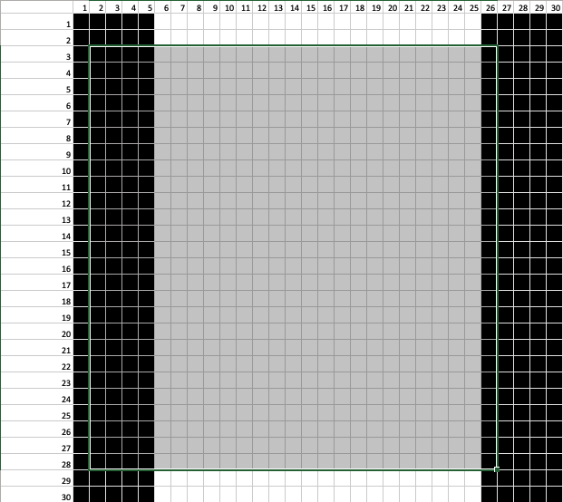

<h1 style="text-align: center;">
DIP homework 2
</h1>

R08922160 
Natsuki Yamashita(山下夏輝)

### 1. Explain why the discrete histogram equalization technique does not yield a flat histogram in general

What discrete histogram equalization does is to change one intensity value to another intensity value ( pic1 ). It is Not to change pixels which an equal intensity to different intensities generally ( pic2 ).

pic1

pic2

### 2. In the original image used to generate the three blurred images shown, the vertical bars are 5 pixels wide, 100pixels high, and their separation is 20 pixels. The image was blurred using square box kernels of sizes 23,25, and 45 elements on the side, respectively. The vertical bars on the left, lower part of (a) and (c) are blurred, but a clear separation exists between them. However, the bars have merged in image(b), despite the fact that the kernel used to generate this image is mach smaller than the kernel that produced image (c). Explain the reason for this.

When you see this picture picture horizontally, the average of the value  calculated by the 25x25 mask always would be same in (b) because there are the same number of light-color pixels and dark-color pixels in the 25x25 mask. Therefore the response of mask would be same and the gaps between bars would disappear. As pic3 and pic4 shows below, when the mask move 1 pixels, the mask would get the right-side pixel which has same color value as the left-side pixel which just lose. So in the area where the bars exist, wherever the mask is, the numbers of each color-pixels would be same and also the response of the mask would be same. This is why the bars in (b) disappear.

pic 3

pic 4

Unlike 25x25 mask, 23x23 and 45x45 mask does not always have the same response because when the position of the mask step 1 pixel right, the average of the pixel value would be different. So the values of response in the area of the bars would be different. That is why the bars still are visible in (a) and (c).

### 3. Write a program for histogram equalization, and test it with your own selfie took in a relatively dark environment so that we can clearly see the effect of histogram equalization in image enhancement. Please show the histograms of your selfie before and after histogram equalization and explain your results. (Note: You only have to work on the gray-scale image.)

#### The comparison of the images

|         Original Image          |    Histogram-Equalized Image    |
|:-------------------------------:|:-------------------------------:|
|  |  |

As you can see above, Histogram-Equalized Image is higher contrast than Original Image. For example, in Original Image, the boundary between the lest side of my neck and the background is hard to recognize. On the other hand,  Histogram-Equalized Image, the boundary can be distinguished clearly.

#### The comparison of histograms

The histograms of these image in shown above. As you can see, Histogram-Equalized one is higher contrast and sparser than Original one. However even Histogram-Equalized one is not a flat histogram. The shape of Histgram-Equalized one is like horizontally stretched shape of Original one.

#### The comparison of CDFs

As the figure above shows the comparison, the number of pixels in picture is accumulated approximately linearly in Histogram-Equalized one. However, the most of number of pixel have been accumulated in lower intensity range.

Furthermore, considering the figures of histograms and CDFs, in a certain range of intensity level, for example around the 15-25 intensity, the more pixels there are in Original Image, the sparser histogram of that range you get in Histogram-Equalized. That is why the steps of accumulation in the lower intensity range of CDF of Histogram-Equalized are bigger than in the higher intensity range.
