<h1 style="text-align: center;">
DIP homework 3
</h1>

R08922160 
Natsuki Yamashita(山下夏輝)

### 1. Show that subtracting the Laplacian from an image gives a result that is proportional to the unsharp mask in Eq. (3-55). Use the definition for the Laplacian given in Eq.(3-53).

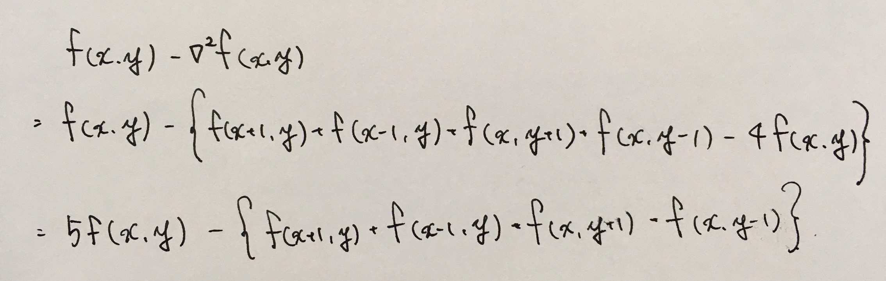
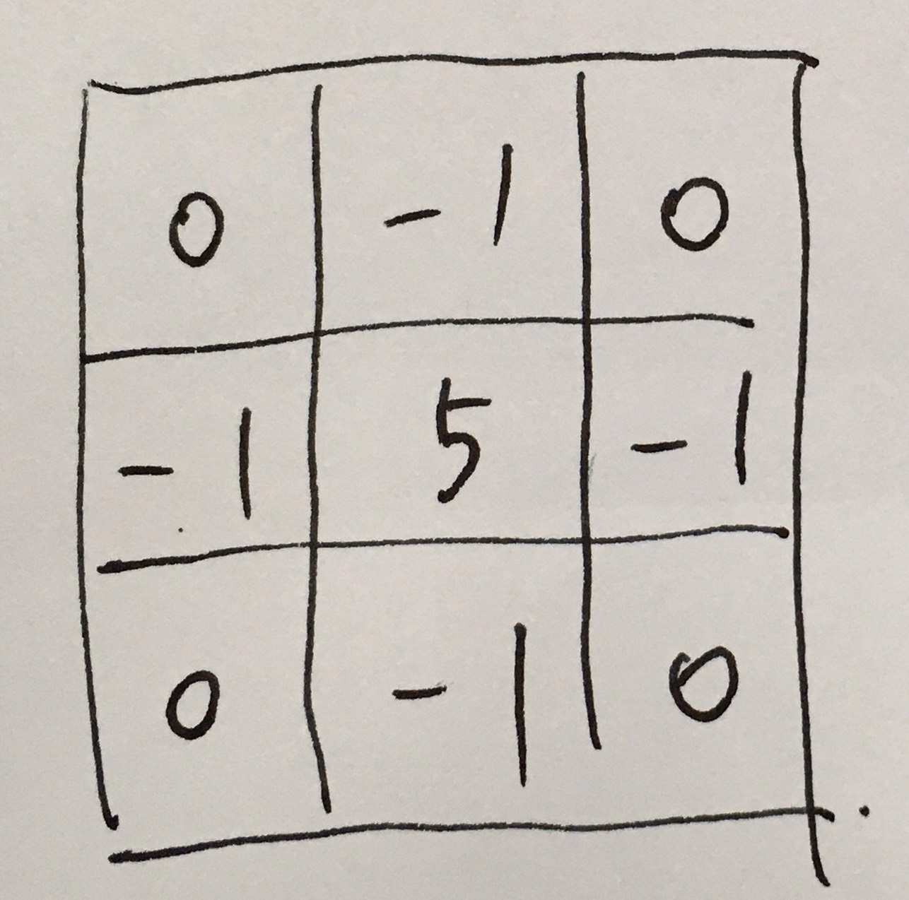

### 2-1. Show that  F { e j2πt0t } = δ( μ - t 0 ), where t$_0$ is a constant.
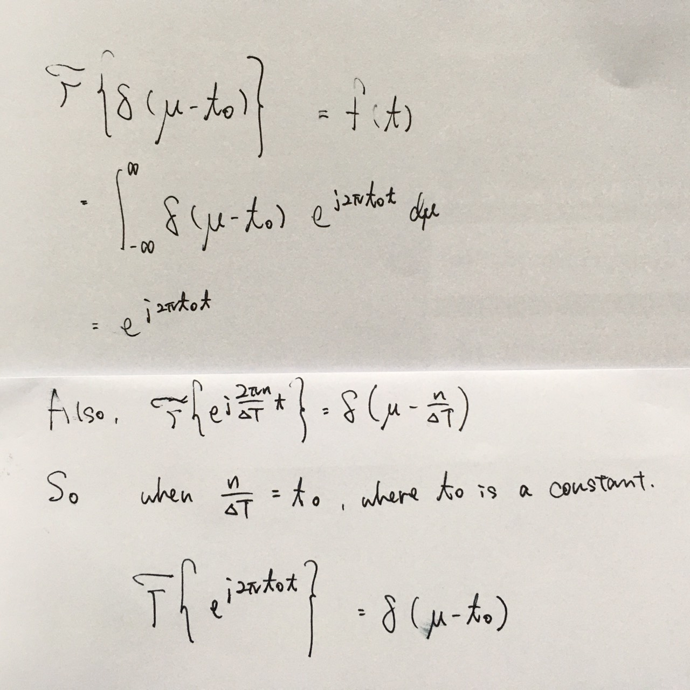

### 2-2. Show that the following expressions are true.
Q.

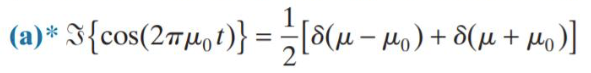

A.
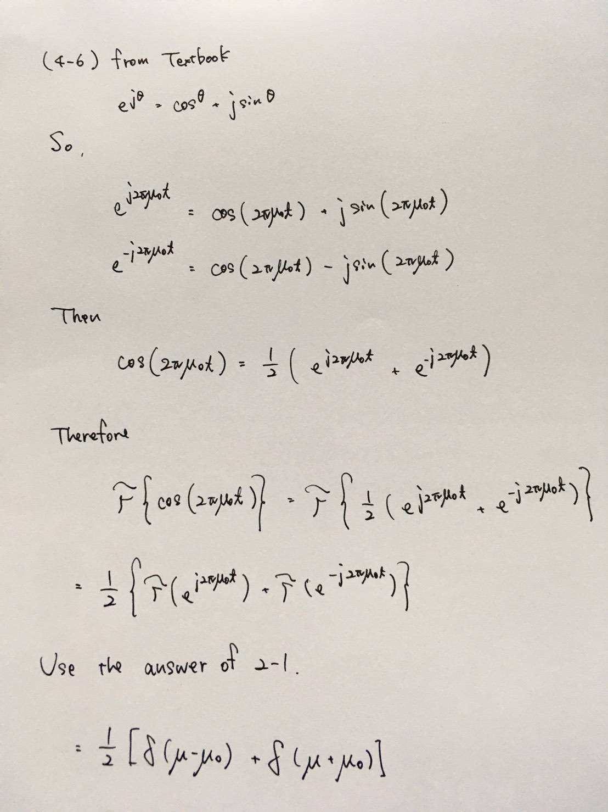

Q.
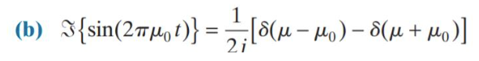

A.
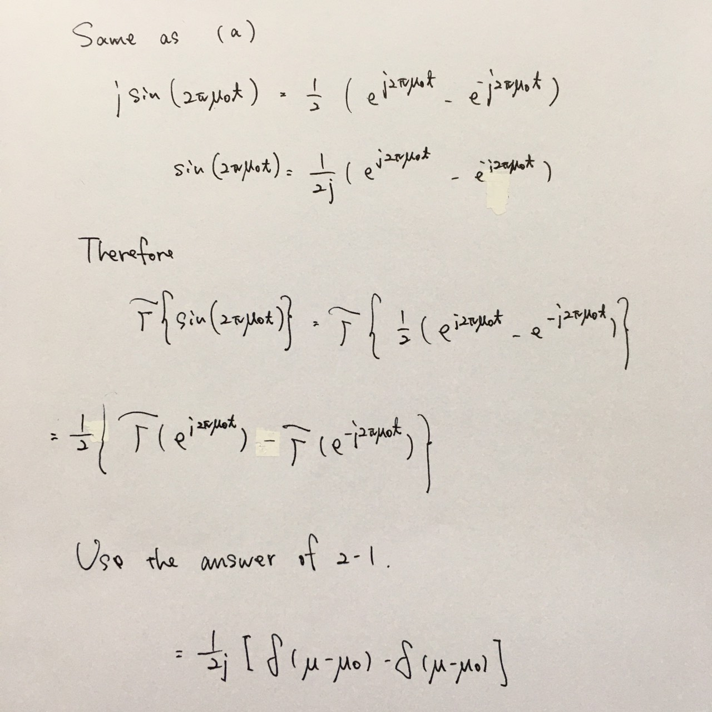

### 3. The image on the left in the figure below consists of alternating stripes of black/white, each stripes being tow pixels wide. The image on the right is the Fourier spectrum of the image on the left, showing the dc term and the frequency terms corresponding to the stripes.(Remember, the spectrum is symmetric so all components, other than the dc term, appear in two symmetric locations.)
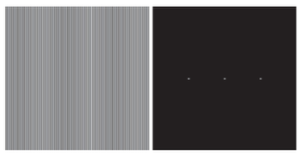

#### (a) Suppose that the stripes of an image of the same size are four pixels wide. Sketch what the spectrum of the image would look like, including only the dc term and the two highest-value frequency terms, which correspond to the two spikes in the spectrum above.

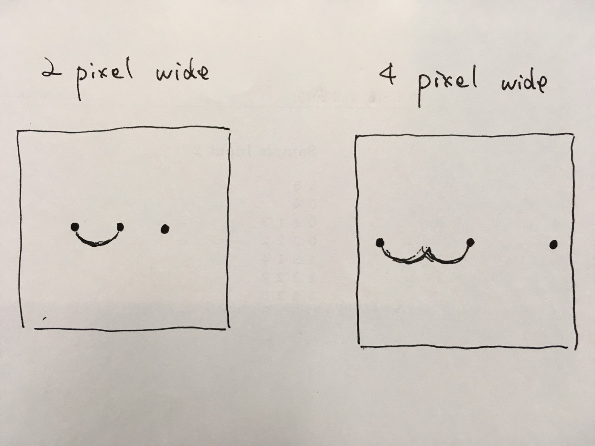

#### (b) Why are the components of the spectrum limited to the horizontal axis?

原來dc term不是跟上面圖一樣在中間，是本來在frequency spectrum的邊邊角角，但這樣人看的時候，不太方便看，所以把切每個頂角這過來在圖像中間位置，這樣子較亮的部分集中在中間比較方便看，這個時候，vertical的方向變成horizontal的方向。如下圖。
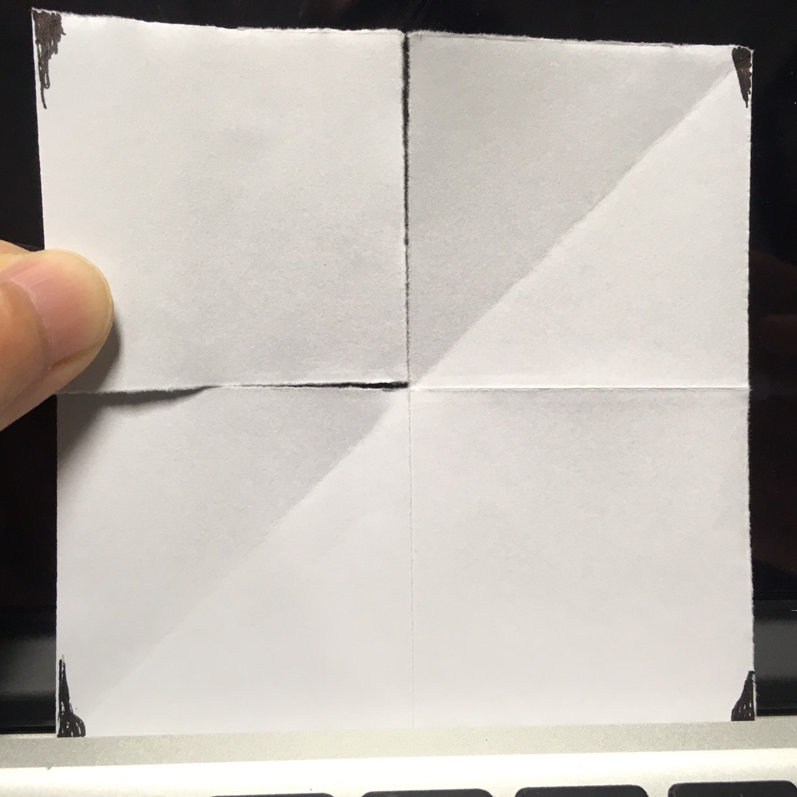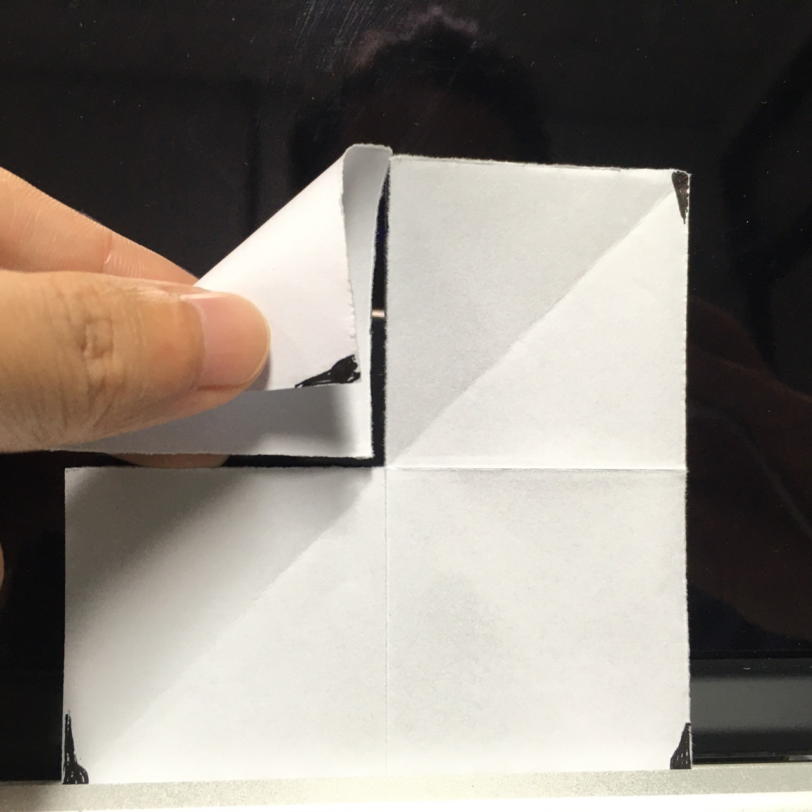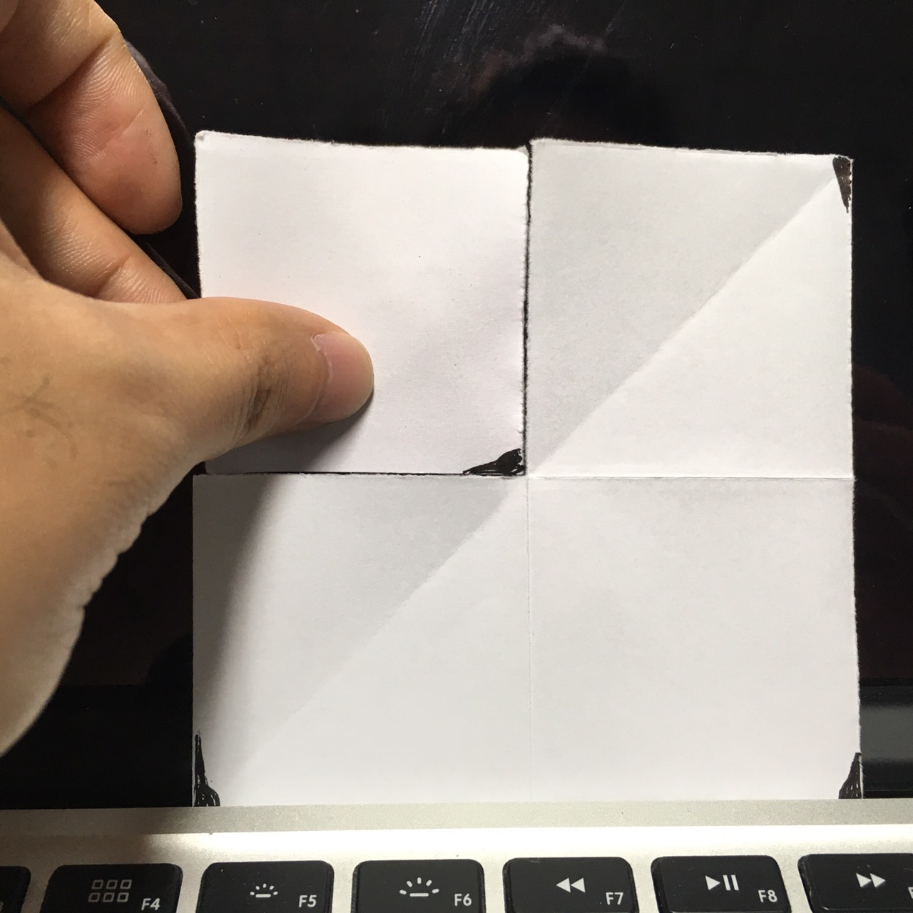

因此，這個圖的spectrum是在horizontal的方向存在。

#### (c) What would the spectrum look like for an image of the same size but having stripes that are one pixel wide? Explain the reason for your answer.

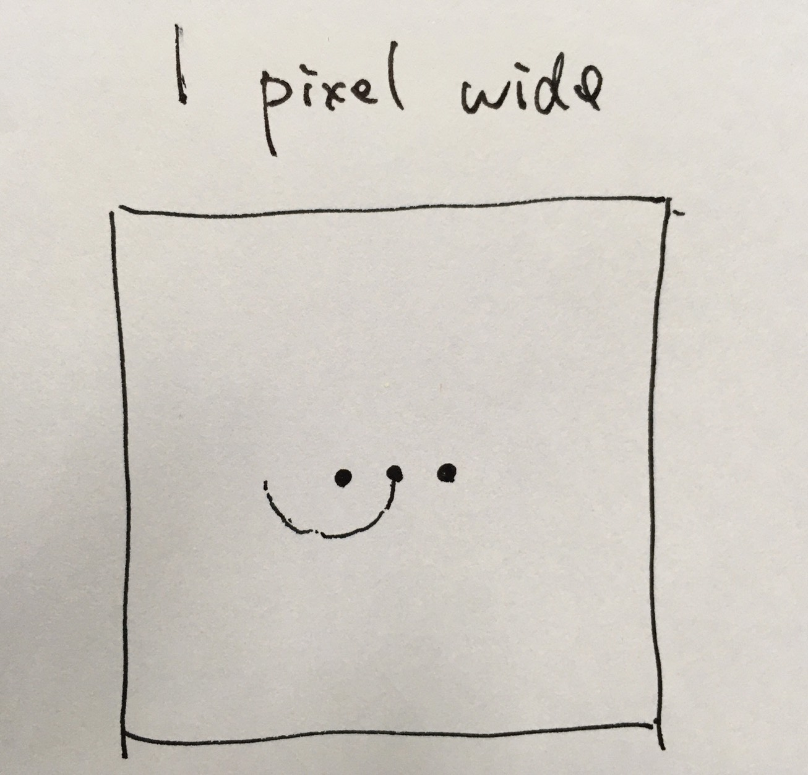

跟（a）一樣的道理，每條線得幅度變細，那麼從左到右看原圖的每個pixel的時候，顏色變動的頻率會變，4pixel的話頻率變低，所以在spectrum裡的亮點距離變遠，相反，1pixel的話頻率變高，所以在spectrum裡的亮點距離變近。

#### (d) Are the dc terms in (a) and (c) the same, or are they different? Explain.

Dc term is defined as $|F(0,0)|= MN|f|$ , where f is a scalar and is the mean gray value of the pixels of the input gray image. So it is coefficient.

Therefore, even if the width of the stripes is changed, the mean gray value of the pixels of the image would not change.

Thus, the dc terms in (a) and (c) are the same.

### 4. Consider the hand X-ray images shown below. The image on the right was obtained by lowpass filtering the image on the left with a Gaussian lowpass filter, and then highpass filtering the result with Gaussian highpass filter. the images are of size 420x344 pixels and D$_0$ = 25 was used for both filter transfer functions.
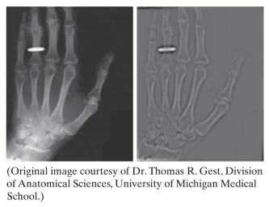

#### (a) Explain why the center part of the finger ring in the figure on the right appears so bright and solid, considering that the dominant characteristic of the filtered image consists of edges of the fingers and wrist bones, with darker areas in between. In other words, would you not expect the highpass filter to render the constant area inside the ring as dark, since a highpass filter eliminates the dc term and reduces low frequencies?

High frequencies are caused by sharp transitions in intensity, such as edges and noise. A high pass filter can enhance sharp detail like the edge or noise and reduce the contrast. It does not mean that a high pass filter detects edge but that it just causes a reduction in contrast in the image. that is why the color of inside of the ring did not become dark.

A Low pass filter do blur the image. It does not reduce the contrast in image basically.

That is why the center part of the finger ring in the figure on the right appears so bright and solid.

#### (b) Do you think the result would have been different if the order of the filtering process had been reversed?

How the two kind of filtering works is as following.

$g(x,y) = Real \{ IDFT [ HP(u,v) LP(u,v) F(u,v) ] \}$
$g(x,y) = Real \{ IDFT [ LP(u,v) HP(u,v) F(u,v) ] \}$

g(x,y) is a processed output, HP(u,v) is a high-pass filtered function, LP(u,v) is a low-pass filtered function, F(u,v) is the DFT of the input image.

The product HP(u,v)LP(u,v)F(u,v) is formed using element-wise multiplication. Therefore, the output would NOT be different how ever the order of the filtering is and whichever the Ideal, the Gaussian or Butterworth transfer function is used.

### Dear TAs

不好意思，我的英文和中文都沒有很好，如果您們沒有看懂的話，請您們給我一個機會向你們親自說明我的答案。我的 email address 如下，感謝！

r08922160@ntu.edu.tw
